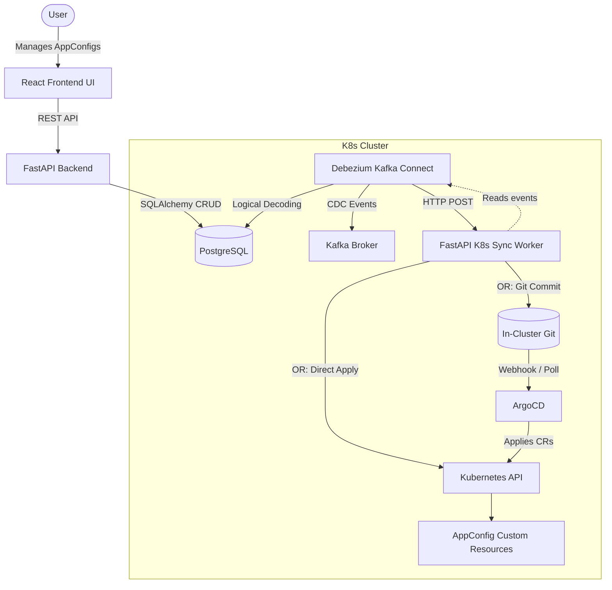

# Resource Renderer Controller Pattern PoC

This project is a Proof of Concept demonstrating the "Resource Renderer Controller Pattern". It showcases a Kubernetes-native application that persists its state in a PostgreSQL database. Changes in the database are captured via Debezium (CDC) and published to Kafka. A custom Kubernetes Sync Worker consumes these events and translates them into Kubernetes Custom Resources (`AppConfig`), effectively rendering the database state into the cluster.

## Architecture Diagram



## Prerequisites
- A Kubernetes cluster (e.g., Minikube, k3d, Docker Desktop K8s)
- `kubectl` configured
- `helm` installed
- `docker` (to build the images)

## Deployment Guide

### 1. Install Base Infrastructure (Helm)
First, deploy PostgreSQL and Kafka using the provided script.
```bash
./k8s/infrastructure/install-infra.sh
```
*Wait for the Pods to become ready before proceeding.*

### 2. Install GitOps Infrastructure (Git Server & ArgoCD)
Deploy the local Git server and ArgoCD seamlessly:
```bash
./k8s/infrastructure/install-cd.sh
```
*Port-forward ArgoCD `kubectl port-forward svc/argocd-server -n default 8080:80` to view the UI.*

### 3. Deploy Kafka Connect (Debezium)
Apply the Kafka connect deployment:
```bash
kubectl apply -f k8s/infrastructure/kafka-connect.yaml
```
Once the pod is running, register the Postgres Debezium source connector and the HTTP Sink connector by port-forwarding the service:
```bash
kubectl port-forward svc/kafka-connect 8083:8083 &
./k8s/infrastructure/register-connector.sh
./k8s/infrastructure/register-http-sink.sh
```

### 4. Apply the Custom Resource Definition (CRD)
```bash
kubectl apply -f k8s/crd.yaml
```

### 5. Build and Deploy Custom Components
To build the images locally (assuming you are pointing to your cluster's Docker daemon, e.g. `eval $(minikube docker-env)`):

```bash
# Build Custom Kafka Connect (with HTTP Sink)
docker build -t resource-renderer-kafka-connect:latest -f ./k8s/infrastructure/Dockerfile.connect ./k8s/infrastructure
# Build Backend
docker build -t resource-renderer-backend:latest ./backend
# Build Frontend
docker build -t resource-renderer-frontend:latest ./frontend
# Build Sync Worker
docker build -t resource-renderer-sync-worker:latest ./resource-sync-worker

# IMPORTANT: If using KinD (Kubernetes in Docker), you MUST load these directly into the cluster nodes:
kind load docker-image resource-renderer-kafka-connect:latest resource-renderer-backend:latest resource-renderer-frontend:latest resource-renderer-sync-worker:latest --name resource-renderer-cluster
```

Now deploy them to the cluster:
```bash
kubectl apply -f k8s/backend-deployment.yaml
kubectl apply -f k8s/frontend-deployment.yaml
kubectl apply -f k8s/resource-sync-worker-deployment.yaml
```

### 6. Access the Frontend UI
Port-forward the frontend service to access it on your browser:
```bash
kubectl port-forward svc/frontend 8080:80
```
Visit http://localhost:8080 and start creating `AppConfig` items!

## Verification
Whenever you create, update, or delete an item in the UI:
1. The backend updates the Postgres database.
2. Debezium detects the change and pushes an event to Kafka.
3. The Kafka Connect HTTP Sink pushes the event to the Sync Worker, which either applies the Custom Resource directly to Kubernetes OR commits it to Git (for ArgoCD to apply).

Run `kubectl get appconfigs -w` to instantly see your configurations reflected in the cluster state!

## Fault Tolerance & Zero Data Loss
The system guarantees at-least-once delivery for CDC events. If the `resource-sync-worker` is completely down:
- The HTTP Sink Connector holds the Kafka offset.
- It will incrementally backoff and perpetually retry sending the payload (`max.retries` is configured high to prevent the task from failing immediately).
- Pended events are queued durably inside Kafka.
- Once the worker starts up, the Sink receives a `200 OK`, commits the offset, and immediately flushes the backlog of accumulated changes into the cluster.
